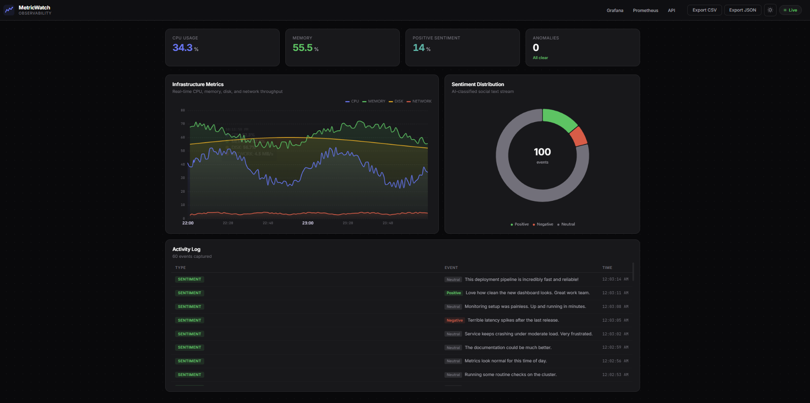

<div align="center">

# MetricWatch

**Self-hosted real-time observability + AI sentiment analysis**

Monitor your systems, analyze text sentiment, and visualize everything in a live dashboard — one command to deploy.

[](docker-compose.yml)
[](api-gateway/)
[](dashboard/)
[](docker-compose.yml)
[](api-gateway/)
[](LICENSE)



</div>

---

## Quick Start

**Prerequisites:** Docker Desktop (or Docker Engine + Compose), 6–8 GB RAM

```bash
git clone https://github.com/bonin1/MetricWatch.git
cd MetricWatch
```

**Linux / macOS / Git Bash:**
```bash
./start.sh
```

**Windows (PowerShell or CMD)** — do **not** use `./start.sh` (Windows opens it in VS Code instead of running it):
```powershell
.\start.ps1
# or
start.cmd
```

That's it. No external Kafka required.

| Service | URL | Credentials |
|---------|-----|-------------|
| **Dashboard** | http://localhost:3000 | — |
| **API** | http://localhost:8000 | — |
| **Grafana** | http://localhost:3001 | `admin` / `admin` |
| **Prometheus** | http://localhost:9090 | — |
| **Alertmanager** | http://localhost:9093 | — |

```bash
# CLI helpers
./cli/metricwatch.sh status
./cli/metricwatch.sh scale sentiment-consumer 3
./cli/metricwatch.sh topics
```

### Seed demo data

Fill the dashboard with sample metrics and sentiment (stack must be running):

```powershell
# Windows
.\scripts\seed.ps1

# Linux / macOS
./scripts/seed.sh
```

Then refresh http://localhost:3000. See [scripts/README.md](scripts/README.md) for options.

### Verify it works

```powershell
.\scripts\smoke_test.ps1
```

Full walkthrough (API, dashboard, Prometheus, Grafana): **[docs/TESTING.md](docs/TESTING.md)**

---

## Features

| | |
|---|---|
| 📡 **Event-driven** | Apache Kafka + Zookeeper bundled with health checks |
| 📊 **Live dashboard** | React + ECharts, WebSocket updates, dark/light mode |
| 🤖 **AI sentiment** | DistilBERT (optional) or lightweight keyword mode |
| 🔍 **Anomaly detection** | Z-score alerts on metric streams |
| 💾 **Multi-storage** | Redis, MongoDB, PostgreSQL, Elasticsearch |
| 📈 **Observability** | Prometheus, Grafana dashboards, Alertmanager rules |
| 📤 **Export** | CSV/JSON export from API and dashboard |
| 🐳 **Production-ready Docker** | Pinned images, resource limits, multi-stage builds |

---

## Use Cases

- **Monitor personal projects** — drop-in stack for homelab or side projects
- **Learn microservices** — Kafka consumers, event sourcing, polyglot storage
- **Base for custom monitoring** — send metrics from your own apps ([integration guide](docs/INTEGRATION.md))
- **Demo / portfolio** — impressive real-time dashboard out of the box

---

## Architecture

```
┌─────────────────────────────────────────────────────────────────┐
│              Kafka + Zookeeper (included in compose)             │
│                   system-metrics · social-text                   │
└──────────────┬────────────────────────────────┬─────────────────┘
               │                                │
       ┌───────▼────────┐              ┌───────▼────────┐
       │   Producers    │              │   Consumers    │
       │ Metrics·Social │              │ Metrics·AI     │
       └────────────────┘              └────┬───────────┘
                                            │
                    ┌───────────────────────┴──────────────────┐
                    │  Redis · MongoDB · Postgres · Elasticsearch │
                    └───────────────────────┬────────────────────┘
                                   ┌────────▼────────┐
                                   │  API + WebSocket │
                                   └────────┬────────┘
                                   ┌────────▼────────┐
                                   │ React Dashboard  │
                                   └─────────────────┘
```

---

## Screenshots


| Dashboard | Grafana | Prometheus |
|-----------|---------|------------|
| http://localhost:3000 | http://localhost:3001 | http://localhost:9090 |

---

## Configuration

Copy `.env.example` → `.env` (done automatically by `start.sh`):

```env
# Lightweight mode — no 250MB model download
SENTIMENT_MODE=keyword

# Or full AI (default)
SENTIMENT_MODE=transformers

# Anomaly detection
ANOMALY_DETECTION_ENABLED=true
ANOMALY_ZSCORE_THRESHOLD=3.0

# Structured logs
LOG_FORMAT=json
```

See [`.env.example`](.env.example) for all options.

---

## Send metrics from your app

```bash
# Python example
pip install confluent-kafka
KAFKA_BOOTSTRAP_SERVERS=localhost:29092 python examples/python_fastapi_producer.py

# Node.js example
npm install kafkajs
KAFKA_BOOTSTRAP_SERVERS=localhost:29092 node examples/nodejs_producer.js
```

Full guide: [docs/INTEGRATION.md](docs/INTEGRATION.md)

---

## API highlights

| Endpoint | Description |
|----------|-------------|
| `GET /health` | Health check |
| `GET /api/metrics/latest` | Latest metrics (Redis) |
| `GET /api/metrics/history` | Time-series (PostgreSQL) |
| `GET /api/anomalies/recent` | Recent z-score anomalies |
| `GET /api/export/metrics?format=csv` | Export metrics |
| `GET /api/sentiment/stats` | Sentiment distribution |

WebSocket events: `metric_update`, `sentiment_update`

---

## Scaling

```bash
docker compose up -d --scale sentiment-consumer=3
./cli/metricwatch.sh scale metrics-consumer 2
```

---

## Development

```bash
# Run tests
pip install -r tests/requirements.txt -r api-gateway/requirements.txt -r shared/requirements.txt
pytest tests/ -v

# Dashboard dev server
cd dashboard && npm install && npm run dev
```

---

## Project structure

```
MetricWatch/
├── scripts/          # Seed demo data (seed.ps1 / seed.sh)
├── shared/           # Kafka, storage, logging, anomaly detection
├── producers/        # Metrics & social text producers
├── consumers/        # Metrics processor & sentiment analyzer
├── api-gateway/      # FastAPI + Socket.IO
├── dashboard/        # React + Vite
├── prometheus/       # Prometheus + Alertmanager config
├── grafana/          # Dashboards & provisioning
├── examples/         # Node.js & Python producers
├── cli/              # metricwatch.sh / metricwatch.ps1
├── start.sh          # One-command deploy
└── docker-compose.yml
```

---

## Troubleshooting

| Issue | Fix |
|-------|-----|
| Services won't start | Ensure 6–8 GB RAM; `docker compose logs <service>` |
| Slow first boot | Sentiment model download (~250MB) — use `SENTIMENT_MODE=keyword` |
| No dashboard data | Check WebSocket indicator (top-right); verify producers running |
| Kafka connection | Kafka is included — use `kafka:9092` inside Docker, `localhost:29092` from host |

---

## License

MIT — use freely for learning and production.

**Built with Kafka, Python, React, and AI**
